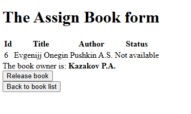
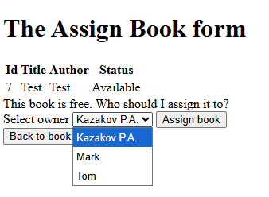
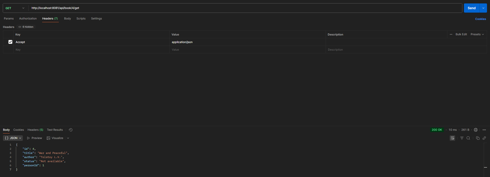
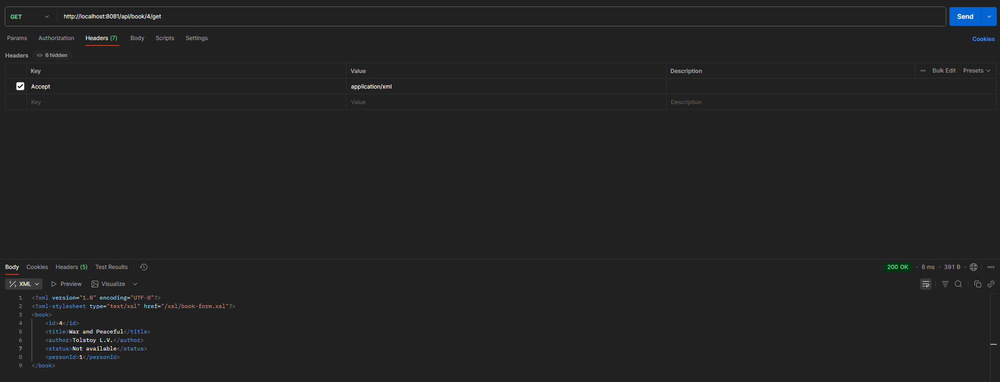

# Практическая работа №2
*Выполнили студенты группы 6132-010402D Казаков П.А. и Маъруфжонов А.А.*
## Приложение на Spring
### Общее задание
Необходимо разработать приложение, используя типовую архитектуру и технологии Spring. Оно должно иметь три слоя (данные, логика, представление) и предоставлять средства для работы с базой данных.
#### Задание 1
Была выбрана та же предметная область, что и в первой лабораторной работе: **библиотека**.

Скрипты для создания таблиц **"Person"** и **"Book"** в **PostgreSQL**:
```
CREATE TABLE person (
    id bigint NOT NULL,
    full_name text NOT NULL,
    year_of_birth bigint NOT NULL,
    email text NOT NULL,
    PRIMARY KEY (id)
);

CREATE TABLE book (
    id bigint NOT NULL,
    title text NOT NULL,
    author text NOT NULL,
    status text NOT NULL,
    person_id bigint,
    PRIMARY KEY (id),
    FOREIGN KEY (person_id)
        REFERENCES "Person" (id)
);
```

#### Задание 2
В файле application.properties прописаны параметры конфигурации для подключения к базе данных **PostgreSQL**. Реализованы две сущности: **Person** и **Book**.
Практически всё в них идентично предыдущей лабораторной работе. Учтено использование значений из конструктора **BookStatus** в thymeleaf-шаблонах.

Доступ к данным осуществляется через классы репозиториев **PersonRepository** и **BookRepository** реализующие интерфейс `JpaRepository`.

#### Задание 3
Сервисный слой был реализован с использованием `@Service` аннотации для обеспечения бизнес-логики. Также созданы сервисы **PersonService** и **BookService**, которые используют репозитории для работы с базой данных.

#### Задание 4
Web-слой был реализован с использованием **Spring MVC**. Были созданы контроллеры для обработки запросов и отображения данных в представлениях **HelloController**, **PersonController** и **BookController**. Контроллеры используют аннотацию `@Controller` и методы с аннотациями `@GetMapping`, `@PostMapping`, `@PatchMapping` и `@DeteleMapping`.

Также использовался шаблонизатор **Thymeleaf** для генерации HTML-страниц.

#### Задание 5
После запуска сервера, приложение можно открыть в браузере. Страницы аналогичны предыдущей работе, за исключением новой, для присвоения книги пользователю:




# Практическая работа №3
*Выполнили студенты группы 6132-010402D Казаков П.А. и Маъруфжонов А.А.*
## RESTful веб-сервис
### Общее задание
Необходимо разработать приложение с внешним интерфейсом в виде REST веб-сервиса. Приложение должно предоставлять доступ к данным в базе данных.
#### Задание 1
Плюсы и минусы **JAX-RS**:
+ Является стандартной спецификацией Java EE, поддерживаемой многими серверами приложений.
+ Простота использования и интеграции в Java EE проекты.
+ Хорошая поддержка аннотаций.
- Меньшая гибкость и расширяемость по сравнению с Spring.
- Меньше встроенных функций для работы с другими компонентами, такими как безопасность и доступ к данным.

Плюсы и минусы **SpringREST**:
+ Интеграция с большим количеством модулей Spring.
+ Удобство настройки и расширяемость.
+ Поддержка разработки RESTful сервисов с минимальным количеством конфигурации через Spring Boot.
- Может быть избыточным для небольших проектов.
- Требует базового понимания фреймворка Spring.

Был выбран **SpringREST**, использование **Spring Boot** упрощает настройку проекта и уменьшает количество конфигурации, предоставляется широкий выбор инструментов и библиотек для работы с REST API, а также имеется встроенная поддержка JSON и XML через **Jackson**.

#### Задание 2
Для разработки было выбрано приложение практической работы №2, в которой использовался фреймворк **Spring**. 

Для создания **REST API** были сделаны REST-контроллеры **PersonRestController** и **BookRestController**.

#### Задание 3
API было расширено для поддержки форматов **JSON** и **XML**.

Для конвертации данных в нужный формат были созданы классы конвертеры **BookConverter** и **PersonConverter**. А также были созданы DTO-классы **BookDto** и **PersonDto**, в которые происходит преобразование моделей при передаче и приеме данных.

#### Задание 4
Для того чтобы браузер мог отобразить XML-ответы сервера, были реализованы XSL-преобразования, которые находятся в папке `resources/static/xsl`. 

Чтобы была возможность сохранения объектов через XSL-преобразования, были добавлены функции на языке **JavaScript**, преобразующие значения формы в **JSON**. JS-файлы находятся в папке `resources/static/js`.

#### Задание 5
Добавление тега с данными об XSL-преобразовании к XML-ответов сервера происходит в классе **XmlTransformer**.

#### Задание 6
Пример JSON-ответа сервера:



Пример XML-ответа сервера:



Пример XSL-преобразования XML-ответа сервера:

